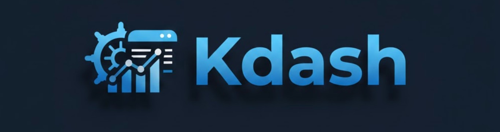

<p align="center">
  
</p>

<h1 align="center">Kdash - Terraform Kubernetes Dashboard Module</h1>

<p align="center">
  <strong>A highly configurable Terraform module for deploying the Kubernetes Dashboard via Helm on AWS EKS or any Kubernetes cluster.</strong>
</p>

<p align="center">
  <a href="#features">Features</a> •
  <a href="#requirements">Requirements</a> •
  <a href="#usage">Usage</a> •
  <a href="#inputs">Inputs</a> •
  <a href="#outputs">Outputs</a> •
  <a href="#accessing-the-dashboard">Accessing the Dashboard</a>
</p>

---

## Why Kdash?

> **Note from Kubernetes Official Docs:**  
> *"Kubernetes Dashboard supports only Helm-based installation currently as it is faster and gives us better control over all dependencies required by Dashboard to run."*

Kdash simplifies the deployment of Kubernetes Dashboard by wrapping the official Helm chart in a Terraform module, giving you:
- Infrastructure as Code (IaC) approach
- Reproducible deployments
- Easy integration with existing Terraform workflows
- Pre-configured admin token for immediate access

---

## Features

- ✅ Deploy Kubernetes Dashboard via Helm
- ✅ Automatic namespace creation
- ✅ Admin service account with cluster-admin privileges
- ✅ Long-lived token for dashboard authentication
- ✅ Configurable dashboard settings (cluster name, pagination, auto-refresh, etc.)
- ✅ Support for custom labels and annotations
- ✅ Works with AWS EKS, GKE, AKS, or any Kubernetes cluster

---

## Requirements

| Name | Version |
|------|---------|
| Terraform | >= 1.0 |
| Kubernetes Provider | ~> 2.20 |
| Helm Provider | ~> 2.6 |

### Prerequisites

- A running Kubernetes cluster
- `kubectl` configured to access your cluster
- Kubeconfig file at `~/.kube/config` (or configure provider accordingly)

---

## Usage

### Basic Usage

```hcl
module "kdash" {
  source = "path/to/terraform-kdash"

  namespace            = "kubernetes-dashboard"
  create_namespace     = true
  create_admin_token   = true
  dashboard_cluster_name = "my-cluster"
}
```

### Advanced Usage

```hcl
module "kdash" {
  source = "path/to/terraform-kdash"

  # Namespace Configuration
  namespace        = "monitoring"
  create_namespace = true

  # Authentication
  create_admin_token = true
  enable_skip_button = false  # Require login

  # Chart Version (optional - defaults to latest stable)
  chart_version = "7.13.0"

  # App Mode: "dashboard" (full) or "api" (API only)
  app_mode = "dashboard"

  # Dashboard UI Settings
  dashboard_cluster_name                     = "production-cluster"
  dashboard_items_per_page                   = 50
  dashboard_labels_limit                     = 5
  dashboard_logs_auto_refresh_interval       = 3
  dashboard_resource_auto_refresh_interval   = 5
  dashboard_disable_access_denied_notifications = true
  dashboard_hide_all_namespaces              = false
  dashboard_default_namespace                = "default"
  dashboard_namespace_fallback_list          = ["default", "kube-system"]

  # Custom Labels & Annotations
  labels = {
    environment = "production"
    team        = "platform"
  }

  annotations = {
    "app.kubernetes.io/managed-by" = "terraform"
  }
}
```

### Get Admin Token After Deployment

```hcl
# Output the token (use with caution - it's sensitive!)
output "dashboard_token" {
  value     = module.kdash.admin_token
  sensitive = true
}
```

To retrieve the token:
```bash
terraform output -raw dashboard_token
```

---

## Inputs

### Core Configuration

| Name | Description | Type | Default | Required |
|------|-------------|------|---------|:--------:|
| `namespace` | Namespace where Dashboard will be deployed | `string` | `"kubernetes-dashboard"` | no |
| `create_namespace` | Whether to create the namespace | `bool` | `true` | no |
| `create_admin_token` | Create admin service account and token for authentication | `bool` | `true` | no |
| `enable_skip_button` | Enable skip login page for read-only access | `bool` | `true` | no |
| `chart_version` | Kubernetes Dashboard Helm chart version | `string` | `"7.13.0"` | no |
| `app_mode` | Deploy mode: `"dashboard"` (full) or `"api"` (API only) | `string` | `"dashboard"` | no |

### Dashboard UI Settings

| Name | Description | Type | Default | Required |
|------|-------------|------|---------|:--------:|
| `dashboard_cluster_name` | Cluster name displayed in browser window title | `string` | `""` | no |
| `dashboard_items_per_page` | Max items shown per list page | `number` | `20` | no |
| `dashboard_labels_limit` | Max labels displayed by default | `number` | `3` | no |
| `dashboard_logs_auto_refresh_interval` | Seconds between logs auto-refresh | `number` | `5` | no |
| `dashboard_resource_auto_refresh_interval` | Seconds between resource auto-refresh (0 to disable) | `number` | `10` | no |
| `dashboard_disable_access_denied_notifications` | Hide access denied warnings | `bool` | `false` | no |
| `dashboard_hide_all_namespaces` | Hide 'All Namespaces' option in dropdown | `bool` | `false` | no |
| `dashboard_default_namespace` | Default namespace after login | `string` | `"default"` | no |
| `dashboard_namespace_fallback_list` | Fallback namespaces for users without list privileges | `list(string)` | `["default"]` | no |

### Labels & Annotations

| Name | Description | Type | Default | Required |
|------|-------------|------|---------|:--------:|
| `labels` | Common labels for all Dashboard resources | `map(string)` | `{}` | no |
| `annotations` | Common annotations for all Dashboard resources | `map(string)` | `{}` | no |

---

## Outputs

| Name | Description | Sensitive |
|------|-------------|:---------:|
| `admin_token` | Admin token for dashboard authentication | ✅ |
| `admin_service_account` | Name of the admin service account | ❌ |
| `namespace` | Namespace where Dashboard is deployed | ❌ |

---

## Accessing the Dashboard

### Method 1: Port Forward (Recommended for Development)

```bash
# Get the namespace
NAMESPACE=$(terraform output -raw namespace)

# Port forward the Kong proxy service
kubectl -n $NAMESPACE port-forward svc/kubernetes-dashboard-kong-proxy 8443:443

# Access the dashboard
# Open: https://localhost:8443
```

### Method 2: Using the Admin Token

1. Get the token using Terraform:
```bash
terraform output -raw admin_token
```

Or directly via kubectl:
```bash
kubectl get secret kdash-admin-token -n kubernetes-dashboard -o jsonpath="{.data.token}" | base64 -d
```

2. Access the dashboard via port-forward (see above)

3. Select "Token" authentication and paste the token

### Method 3: NodePort / LoadBalancer

Configure the Kong proxy service type in the Helm values for external access (not included in current module configuration).

---

## File Structure

```
terraform-kdash/
├── main.tf           # Dashboard Helm release & namespace
├── admin-token.tf    # Admin service account, role binding & token
├── variables.tf      # Input variables
├── outputs.tf        # Output values
├── provider.tf       # Provider configuration
├── values.yaml       # Reference Helm values (not used directly)
└── README.md         # This file
```

---

## Contributing

Contributions are welcome! Please feel free to submit a Pull Request.

---

## License

This project is licensed under the Apache License 2.0 - see the [LICENSE](LICENSE) file for details.

---

## References

- [Kubernetes Dashboard Official Documentation](https://kubernetes.io/docs/tasks/access-application-cluster/web-ui-dashboard/)
- [Kubernetes Dashboard GitHub Repository](https://github.com/kubernetes/dashboard)
- [Kubernetes Dashboard Helm Chart](https://artifacthub.io/packages/helm/k8s-dashboard/kubernetes-dashboard)
